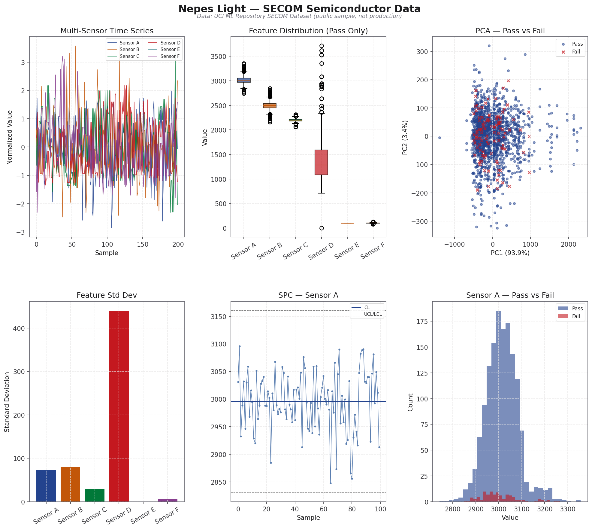
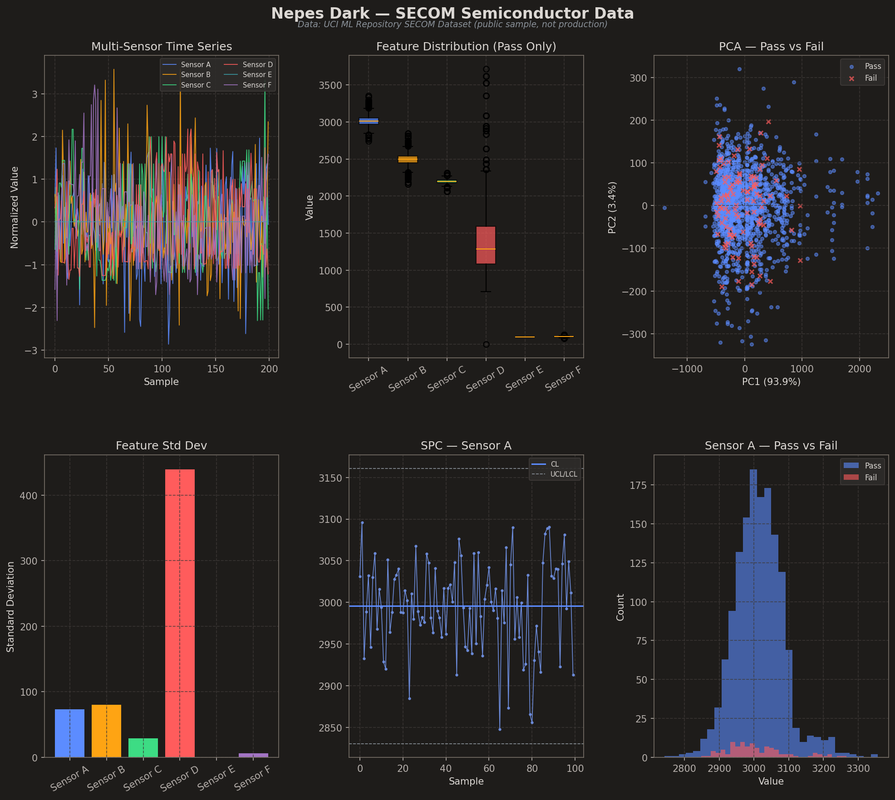

#+TITLE: mplstyle-nepes — Nepes Color Palette for matplotlib
#+AUTHOR: Kay Park

Corporate color palette for =matplotlib=, derived from the Nepes brand identity.
WCAG AA accessible + colorblind-safe. Light theme default.

* Screenshots

** Light Theme

** Dark Theme

/Data: UCI ML Repository SECOM Dataset (public sample, not production)/

* Installation

** pip (recommended)

#+begin_src sh
pip install git+https://github.com/kayspark/mplstyle-nepes
#+end_src

** Manual copy

#+begin_src sh
git clone https://github.com/kayspark/mplstyle-nepes
cp nepes-*.mplstyle ~/.config/matplotlib/stylelib/
#+end_src

* Usage

#+begin_src python
# Option A: import and use()
import nepes_mplstyle
nepes_mplstyle.use("light")  # or "dark"

import matplotlib.pyplot as plt
plt.plot(x, y)  # automatically uses nepes colors

# Option B: style path directly
plt.style.use(nepes_mplstyle.style_path("dark"))

# Option C: if installed to stylelib
plt.style.use("nepes-light")
#+end_src

** SPC Control Charts

#+begin_src python
spc = {
    "center_line":   "#23438E",
    "data_points":   "#5A7EB0",
    "control_limit": "#6A6A6A",
    "spec_limit":    "#C25609",
    "violation":     "#C4181F",
}

ax.axhline(cl, color=spc["center_line"], linewidth=1.5)
ax.axhline(ucl, color=spc["control_limit"], linestyle="--")
ax.scatter(violations, values[violations], color=spc["violation"], marker="D")
#+end_src

* Palette

| # | Name   | Light Hex | Dark Hex  |
|---+--------+-----------+-----------|
| 1 | Blue   | =#23438E= | =#5C8CFF= |
| 2 | Orange | =#C25609= | =#FEA413= |
| 3 | Green  | =#017939= | =#3DDC84= |
| 4 | Red    | =#C4181F= | =#FF5C5C= |
| 5 | Teal   | =#2D7A82= | =#3A9BA5= |
| 6 | Purple | =#873D8E= | =#A274C3= |

Plus 6 midtone variants for 12-color charts.

* Source

Generated from [[https://github.com/kayspark/nepes-palette][nepes-palette]] — single source of truth for 23 tool themes.
